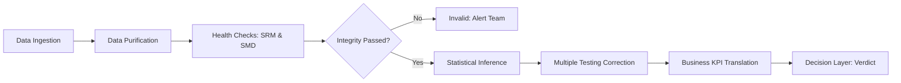

# E-Commerce Decision Science: An End-to-End Experimentation Framework

[](https://www.python.org/)
[](#)
[](https://opensource.org/licenses/MIT)

## 🏛️ Executive Summary
This repository demonstrates a **senior-level experimentation framework** designed to drive product strategy through rigorous statistical inference. Moving beyond simple notebook analysis, this project simulates a production-ready decision engine that validates data integrity, quantifies financial uplift, and provides executive-level deployment recommendations across five concurrent e-commerce experiments.

**Key Outcome**: Identified a cumulative revenue growth opportunity of **~28%** while successfully mitigating a **10.5%** potential revenue loss through rapid experimental rollback.

---

## 🏗️ Architecture & Decision Flow
This framework implements a standardized "Scientific Lab" pipeline, ensuring every experiment follows a consistent path from ingestion to decision.



---

## 🎯 What This Project Demonstrates
This framework serves as a showcase of core competencies in **Analytics Engineering and Decision Science**:
- **Experimental Design Mastery**: Implementation of counterfactual testing with rigorous control/treatment balancing.
- **Statistical Decision-Making**: Use of Z-tests, Welch’s T-tests, and Holm-Bonferroni corrections to eliminate "false wins."
- **Business Impact Modeling**: Translating abstract statistical "lifts" into estimated bottom-line revenue.
- **Data Pipeline Thinking**: Designed as a reusable, modular framework adaptable to any platform experimentation.
- **Stakeholder Synthesis**: Delivering reporting that bridges the gap between technical data and executive action.

---

## 🏬 The Business Scenarios
The framework evaluates five distinct product feature hypotheses, simulating real-world e-commerce optimization:
1.  **Navigational Optimization (Test 1)**: Horizontal vs. Dropdown menu efficiency.
2.  **Algorithmic Discovery (Test 2)**: AI-personalized novelty sorting vs. manual curation.
3.  **Revenue Maximization (Test 3)**: Strategic placement of "Similar Product" recommendations.
4.  **Social Proof Engineering (Test 4)**: High-prominence reviews as a trust-builder.
5.  **Search Algorithm Tuning (Test 5)**: Evaluating the ROI of third-party search integration (Algolia).

---

## 🧪 Scientific Methodology & Methodology Deep-Dive
To ensure production-grade reliability, the framework employs a tiered validation strategy:

### 1. The Validation Guardrails
- **Sample Ratio Mismatch (SRM)**: Chi-square test to detect assignment bias.
- **Standardized Mean Difference (SMD)**: Covariate balance check (Excellent threshold: < 0.1) to ensure identical group characteristics.

### 2. Inference Engines
- **Conversion Rate (CR)**: Two-Proportion Z-Test for large-scale behavioral trials.
- **Average Revenue Per User (ARPU)**: Welch’s T-Test to account for the high variance and skew of financial data.

### 3. Safety Protocols
- **Multiple Testing Correction**: Application of the **Holm-Bonferroni** method to maintain a stable False Discovery Rate (FDR) across concurrent tests.

---

## 💰 Business KPI Translation
*Calculated based on a simulated baseline of $1M monthly revenue per category:*

| Metric | Statistical Lift | Est. Annual Revenue Impact |
| :--- | :--- | :--- |
| **Test 3 (Product Sliders)** | +21.0% | +$2.52M |
| **Test 2 (Novelties)** | +5.8% | +$0.69M |
| **Test 1 (Menu - Loss)** | -10.5% | -$1.26M (Mitigated by Rollback) |

---

## 🚀 Production Scalability & Roadmap
This framework is designed for integration into modern data stacks:
- **Orchestration**: Can be modularized into **Apache Airflow** DAGs for daily stability monitoring and automated report updates.
- **BI Integration**: Results are exported as structured data, ready for ingestion into **Tableau** or **Looker** for real-time executive dashboards.
- **Governance**: Automated SRM alerts can be plumbed into **Slack/Email** to catch engineering errors in the randomization engine within minutes of deployment.

---

## 🏁 Setup & Execution
Detailed instructions for analysts and engineers.

### Environment & Dependencies
```bash
# Core execution stack
pip install pandas numpy scipy statsmodels matplotlib seaborn openpyxl
```

### Execution
1.  Verify raw logs are in the `raw dataset/` directory.
2.  Perform the analysis via the [Core Framework Notebook](file:///c:/Users/abdul/Desktop/data/dec-ab-test-analysis/ab_test_analysis_v2.ipynb).
3.  Review the auto-generated [experiment_summary.xlsx](file:///c:/Users/abdul/Desktop/data/dec-ab-test-analysis/experiment_summary.xlsx) for stakeholder-ready tables.

---
**Author**: Muhammad Abdul Lathief  
**Positioning**: Senior Data Scientist / Analytics Engineer  
**Version**: 7.0 (Senior Portfolio Framework Release)
